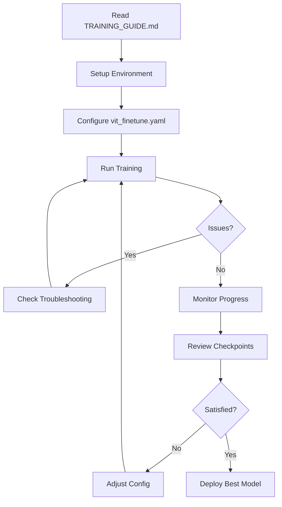

# Orochi-ViT Documentation

Comprehensive documentation for the Orochi Vision Transformer (ViT) biomedical image processing system.

## 📚 Documentation Index

### **[GLOSSARY.md](GLOSSARY.md)** - Terminology & Nomenclature
Complete reference for all terms, abbreviations, and naming conventions used in the project.

**Contents**:
- Model components (ViT, Mamba, Encoder, Decoder)
- Training tasks (IR, REG, FUS, SR, MULTI_TASK)
- Training modes (frozen-decoders, frozen-encoder, full-finetune)
- Checkpoint types and naming convention
- Dataset descriptions
- Loss functions
- Memory management concepts

**Use when**: You encounter unfamiliar terms or abbreviations.

---

### **[ARCHITECTURE.md](ARCHITECTURE.md)** - Technical Design
Deep dive into the system architecture, design decisions, and implementation details.

**Contents**:
- System architecture overview
- ViT encoder design and configuration
- Pretrained decoder integration
- Dimension alignment strategy
- Training pipeline (single-task vs multi-task)
- Memory optimization techniques
- Design rationale and trade-offs

**Use when**: You need to understand how the system works internally.

---

### **[TRAINING_GUIDE.md](TRAINING_GUIDE.md)** - Practical Usage
Step-by-step guide for training the model, monitoring progress, and troubleshooting issues.

**Contents**:
- Quick start commands
- Prerequisites and environment setup
- Configuration options
- Running training (basic and advanced)
- Monitoring with console and wandb
- Checkpoint management
- Troubleshooting common issues
- Performance benchmarks

**Use when**: You want to train the model or debug training issues.

---

## 🚀 Quick Navigation

### I want to...

**Train the model**
→ Start with [TRAINING_GUIDE.md](TRAINING_GUIDE.md#quick-start)

**Understand a term**
→ Look it up in [GLOSSARY.md](GLOSSARY.md)

**Understand how it works**
→ Read [ARCHITECTURE.md](ARCHITECTURE.md)

**Fix an error**
→ Check [TRAINING_GUIDE.md - Troubleshooting](TRAINING_GUIDE.md#troubleshooting)

**Change the training task**
→ See [TRAINING_GUIDE.md - Task Configuration](TRAINING_GUIDE.md#task-configuration)

**Understand checkpoint names**
→ Refer to [GLOSSARY.md - Checkpoint Naming](GLOSSARY.md#checkpoint-naming-convention)

**Optimize memory usage**
→ Review [ARCHITECTURE.md - Memory Optimization](ARCHITECTURE.md#memory-optimization)

---

## 📋 Key Information at a Glance

### Current Configuration

```yaml
Model: Vision Transformer (ViT)
Task: Isotropic Restoration (IR)
Mode: Frozen Decoders (Encoder-only training)
Image Size: [32, 224, 224]
Patch Size: 16
Batch Size: 1
```

### Checkpoint Naming Example

```
vit_ir-task_frozen-decoders_best_epoch-042.pth
 │    │            │             │       │
 │    │            │             │       └─ Epoch number
 │    │            │             └───────── Checkpoint type
 │    │            └─────────────────────── Training mode
 │    └──────────────────────────────────── Task name
 └───────────────────────────────────────── Model type
```

### File Locations

| Item | Path |
|------|------|
| **Training Script** | `src/finetune_with_wandb.py` |
| **Config File** | `configs/vit_finetune.yaml` |
| **ViT Encoder** | `src/vit_encoder.py` |
| **Model Definition** | `src/vit_model.py` |
| **Pretrained Weights** | `pretrained_checkpoints/mamba_fm_3d.pth.tar` |
| **Data** | `/group/jug/aman/orochi/data/` |
| **Checkpoints** | `checkpoints/vit/` |

---

## 🔄 Typical Workflow



---

## 📊 Project Overview

**Goal**: Replace Mamba encoder with ViT while reusing pretrained Mamba decoders for biomedical image tasks.

**Challenge**: ViT and Mamba use different patch sizes (16 vs 4).

**Solution**: Interpolate ViT encoder outputs to match decoder expectations.

**Result**:
- ✓ ViT encoder successfully integrated
- ✓ Pretrained decoders preserved
- ✓ 4x faster with single-task training
- ✓ Fits in 16GB GPU memory

---

## 🔧 Recent Updates

**2026-01-01**:
- ✅ Added single-task training support (4x speedup)
- ✅ Fixed loss computation for single-task mode
- ✅ Improved checkpoint naming with descriptive format
- ✅ Created comprehensive documentation (GLOSSARY, ARCHITECTURE, TRAINING_GUIDE)
- ✅ Aligned config with pretrained checkpoint dimensions

**Key Changes**:
- Default task: `ir` (isotropic restoration)
- Checkpoint format: `{model}_{task}_{mode}_{type}_epoch-{XXX}.pth`
- Image size: [32, 224, 224] (matches pretrained)
- Pretrained decoder loading: Now automatic from config

---

## 📖 Document Structure

Each documentation file follows this structure:

1. **Table of Contents** - Quick navigation
2. **Detailed Sections** - In-depth information
3. **Examples** - Practical code/config snippets
4. **Cross-references** - Links to related docs
5. **Last Updated** - Version tracking

---

## 🆘 Getting Help

1. **Check relevant documentation file** (see navigation above)
2. **Search GLOSSARY.md** for terminology
3. **Review TRAINING_GUIDE.md troubleshooting** section
4. **Open an issue** if problem persists

---

## 🔗 External Resources

- **Orochi Paper**: [Original Mamba-based architecture](https://github.com/AmanKukde/Orochi-Versatile-Biomedical-Image-Processor)
- **Weights & Biases**: [Experiment tracking dashboard](https://wandb.ai)
- **Vision Transformer**: [An Image is Worth 16x16 Words](https://arxiv.org/abs/2010.11929)

---

*Documentation generated: 2026-01-01*
*Project: Orochi-ViT Biomedical Image Processing*
